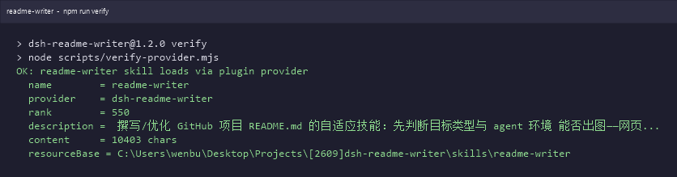
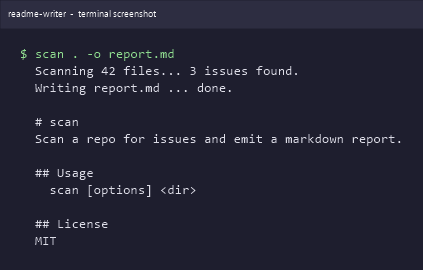

# dsh-readme-writer

> Adaptive GitHub README writing **and** screenshot skill for DeepSeek Harness: detects image-capture capability (web browser, or console/CLI terminal capture), then writes or optimizes README.md with relative-path screenshots and captions.


## What it is

An agent skill for [DeepSeek Harness (dsh)](https://github.com/deepseek-ai/deepseek-harness) that writes
and optimizes GitHub project `README.md`. Its key difference from a plain "README text" generator is
**adaptive screenshots**:

- **Detect target type first**, then capability.
- For a **web page / SPA / dev server** → headless browser screenshot.
- For a **console / CLI project (no web page)** → render its runtime output into a **terminal-style screenshot**
  (.NET System.Drawing on Windows, an HTML-terminal + headless browser, or termtosvg / asciinema).
- If neither is possible → fall back to a text/table "no screenshot" template, still complete.

## Install

As a dsh plugin (cordis skill-bundle, installable via `dsh plugin add`):

~~~bash
# from GitHub (no npm package needed)
dsh plugin --profile <profile> add github:wenbuer/dsh-readme-writer

# from npm, once published
dsh plugin --profile <profile> add dsh-readme-writer
~~~

Or copy the skill into the user skill directory:

~~~bash
mkdir -p ~/.dsh/skills/readme-writer
cp skills/readme-writer/SKILL.md ~/.dsh/skills/readme-writer/
~~~

## Screenshots


*Figure 1: `npm run verify` — the real provider check, proving `readme-writer` loads correctly.*


*Figure 2: terminal screenshot — for a console/CLI project the skill renders runtime output as a terminal-style image.*

## Verify

```
npm run verify
```

Simulates the host `ctx.skills`, calls the plugin provider's `list()`/`get()`, and asserts that the
`readme-writer` skill is discovered and loaded.

## Directory

```
dsh-readme-writer/
├── package.json
├── README.md / README.en.md
├── LICENSE
├── CHANGELOG.md
├── screenshots.json
├── cordis.patch.yml
├── assets/
├── lib/index.js
├── scripts/verify-provider.mjs
├── .github/workflows/verify.yml
├── submission/wenbuer__dsh-readme-writer.yml
└── skills/readme-writer/SKILL.md
```

## License

MIT
